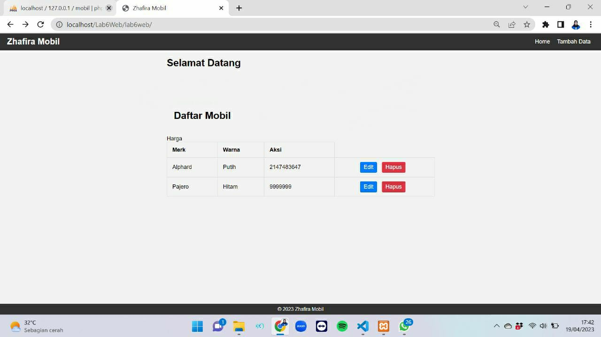
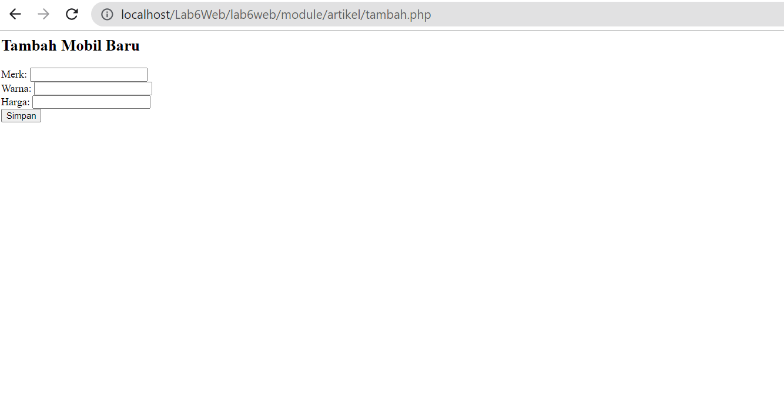
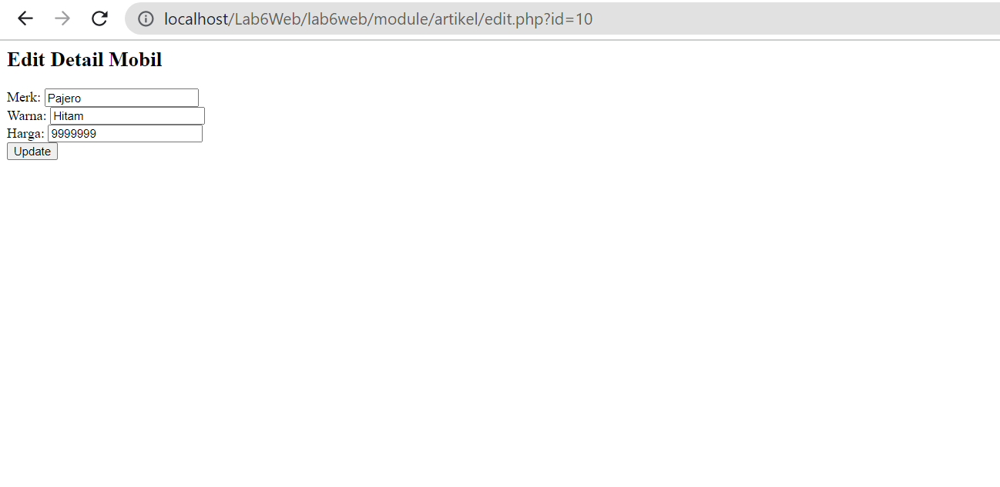

# lab6web
# Tugas Pemograman Web 2
## Profil
| #               | Biodata           |
| --------------- | ----------------- |
| **Nama**        | Zhafira A. K      |
| **NIM**         | 312110067         |
| **Kelas**       | TI.21.A.1         |
| **Mata Kuliah** | Pemrograman Web 2 |

## Praktikum 6: OOP Lanjutan
1.Copy file library (class) dari praktikum 5 dan letakkan pada folder class.

2.Buat file template yang berisi template dan css untuk header, dan footer.

3.Buat modul artikel yang berisi CRUD dengan memanfaatkan library database dan form tersbut.

4.File index.php berisi proses routing aplikasi dan dikombinasikan dengan penggunaan mod_rewrite pada file .htaccess

## Ini Output Home

## Ini Output Tambah Data

## Ini Output Edit

## Terimakasih
